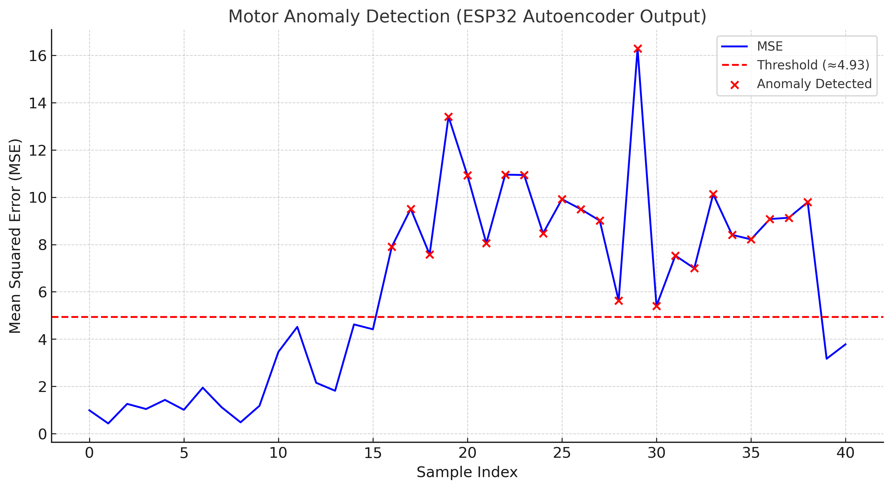

# TinyML Motor Anomaly Detection 🚀

[](LICENSE)


## 📖 Overview
This project demonstrates **edge-based motor anomaly detection** using **TinyML** on the ESP32.  
We trained an **autoencoder** on real-world motor sensor data and deployed it to an ESP32 microcontroller for **real-time anomaly detection**.  

👨‍💻 Developed by **Md. Shoibe Hossain Rifat** and **Antor Biswas**.

---

## 🔧 Hardware Setup
We mounted the following sensors on a DC motor powered by a stable **12V supply**:

- **A3144 Hall Effect Sensor** → RPM measurement  
- **MPU6050** → Vibration & motion sensing  
- **DS18B20** → Temperature monitoring  

All sensors were interfaced with an **ESP32 development board**.

---

## 📊 Data Pipeline
1. Collected sensor readings and exported as `.csv` files  
2. Preprocessed data and trained an **autoencoder** in Python  
3. Converted the model into **TensorFlow Lite**  
4. Exported as a C header file (`.h`) using `tflite_to_header.py`  
5. Deployed onto ESP32 for **on-device inference**

---

## ✅ Results
- The ESP32 successfully detects **motor anomalies in real time**  
- Example plot from the project:  

  

- Quantitative results are available in [`data/autoencoder_results.csv`](data/autoencoder_results.csv)  

---

## 📂 Repository Structure


TinyML-Motor-Anomaly-Detection/
├── README.md                  <- Project overview
├── LICENSE                    <- Apache 2.0 License
│
├── paper/                     <- Research paper & preprint
│   └── Edge_Based_Motor_Anomaly_Detection.pdf
│
├── data/                      <- CSV datasets & results
│   ├── dataset_summary.csv
│   ├── autoencoder_results.csv
│   └── motor_Rh.csv
│
├── src/
│   ├── training/              <- Python training scripts
│   │   ├── train_autoencoder.py
│   │   └── tflite_to_header.py
│   └── esp32_inference/       <- ESP32 Arduino/ESP-IDF code
│       ├── autoencoder_inference.ino
│       └── motor_autoencoder_tflite.h
│
├── figs/                      <- Figures & plots
│   ├── correlation_heatmap.png
│   ├── motor_anomaly_plot.png
│   ├── mse_histogram.png
│   ├── mse_anomalies.png
│   ├── time_series_normalized.png
│   ├── wiring.png
│   └── workflow.png
│
└── docs/                      <- Documentation
├── notes.md
└── wiring.md

````

---

## 🚀 Usage Instructions

### Training
```bash
python src/training/train_autoencoder.py
````

### Convert Model

```bash
python src/training/tflite_to_header.py
```

### Deploy to ESP32

Upload `src/esp32_inference/autoencoder_inference.ino` to your ESP32 using the Arduino IDE.

---

## 📌 Citation

If you use this project, please cite:

**Md. Shoibe Hossain Rifat & Antor Biswas (2025)**
[*Edge-Based Motor Anomaly Detection with TinyML on ESP32*](https://doi.org/10.5281/zenodo.17247714)

---

## 📜 License

This project is licensed under the **Apache 2.0 License** – see [LICENSE](LICENSE) for details.

---
